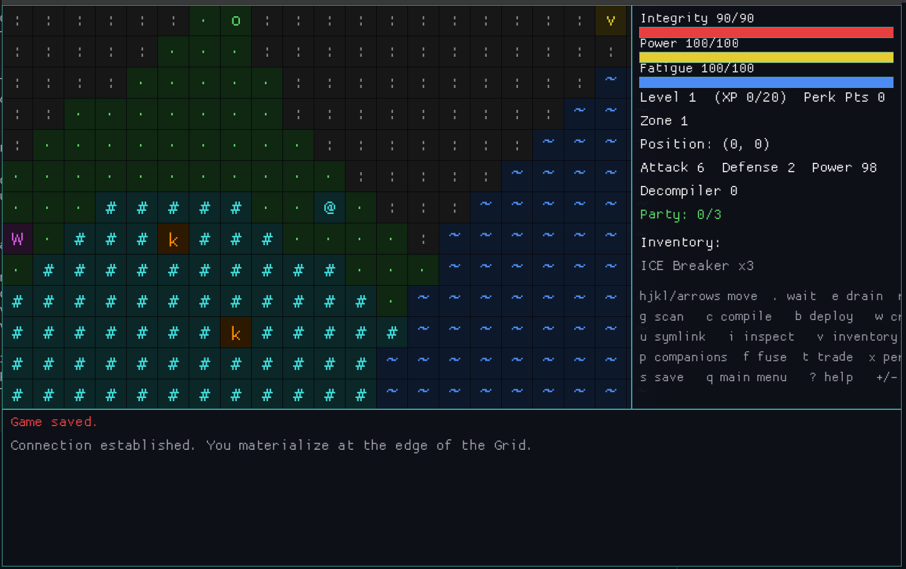

# feral-processes



A Neuromancer/Tron-flavored game blending Pokemon (tame and battle rogue
programs), Palworld (compiled programs work your base for you), and Dwarf
Fortress (procedural world, needs simulation, configurable permadeath).

Single-player, built in Rust. The graphical (GUI) frontend, shown above,
sits on top of a simulation that stays fully decoupled from presentation
so a client/server split is possible later too. A terminal (TUI) frontend
still exists internally as a fallback for headless environments, but it's
no longer user-selectable.

## Installing

You need the Rust toolchain (Cargo). If you don't have it:

```sh
curl --proto '=https' --tlsv1.2 -sSf https://sh.rustup.rs | sh
```

Then clone this repo and build it:

```sh
git clone <this-repo-url> feral-processes
cd feral-processes
cargo build
```

## Playing

Run the `feral-processes` binary (the `launcher` crate):

```sh
cargo run -p feral-processes
```

It launches straight into the graphics window. If no display is available
(e.g. over SSH) or the GUI fails to start, it automatically falls back to
a text UI instead.

To skip `cargo run`'s overhead on every launch, either run the built binary
directly:

```sh
cargo build --release
./target/release/feral-processes
```

or install it onto your `PATH` so you can just type `feral-processes` from
anywhere:

```sh
cargo install --path crates/launcher
```

Either way, the binary still finds `assets/`, `saves/`, and
`run_history.log` in this repo checkout — those paths are resolved at
build time, not from the current directory — so the clone needs to stay
put, but you can run or reinstall the binary from anywhere. Rebuild
(`cargo build --release`) or reinstall (`cargo install --path
crates/launcher`) after pulling code changes to pick them up.

Either way, from the main menu, start a **New Game** and pick a difficulty:

- **Permadeath** — flatlining ends the run for good; a summary is appended
  to `run_history.log`.
- **Forgiving** — flatlining costs you (half Integrity, some Fatigue/Power
  restored) but you keep going, rebooting at the nearest deployed structure
  (or in place, if you haven't built anything yet).

Either way, flatlining also docks a mild (20%) chunk of your current
in-level XP — never a de-level, just a setback. Jacking out of a fight
(`j`) costs the same modest XP setback, so fleeing isn't entirely free
either, but it's a lot cheaper than dying.

Each game session gets its own save file under `saves/` in the repo root,
named from when it was started. Starting a new game (`N`) claims a fresh
file immediately; `s` saves it manually at any time, and it also autosaves
to that same file every 50 game ticks (paced against game time, not
wall-clock time, so it's the same whether you're playing fast or slow) —
silently, so it won't cover up a status message from whatever you just did,
unless the autosave itself fails.

`L` from the main menu opens a list of every save in `saves/`, each shown
with a short summary (level, zone, difficulty, tick). Pick one to choose
**Load** or **Delete**. Save files aren't compatible across updates that
change what gets stored — a save from a different build shows up as
"(incompatible save)" and can still be deleted, just not loaded.

### Controls

| Key | Action |
| --- | --- |
| `hjkl` / arrow keys | Move (bumping a rogue program starts an intrusion) |
| `.` | Wait in place (advances one tick) |
| `e` | Drain a Power Cell (restores Power) |
| `r` | Recharge overnight (restores Fatigue and Integrity, costs Power) — requires standing near a deployed Recharger Node (see [Structures](#structures)) |
| `g` | Scan the sector for Core Fragments |
| `c` | Open the compile menu (compile an ICE Breaker — 3 Core Fragments — a Power Cell — 2 Core Fragments — and any future recipes). Then pick a quantity: type digits and Enter, or `[F]` for 5 at once, or `[M]` for the most you can currently afford |
| `b` | Deploy a structure |
| `w` | Assign a compiled program to a cronjob (work a structure) |
| `G` | Assign a compiled program to guard a structure against raids (any structure, not just a workable one — see [Base defense](#base-defense)) |
| `R` | Demolish a nearby structure, refunding 30% of its materials — demolishing Home destroys every other base structure too, after a confirmation warning (see [Structures](#structures)) |
| `u` | Use symlink: instantly teleport to a deployed symlink structure (e.g. Home), for its item cost |
| `i` | Inspect: pick a direction, see stats/moves/decompile odds for the first program that way (no intrusion) |
| `v` | Inventory/equipment: equip, unequip, erase items |
| `p` | Your pets: full stats (level, HP, Attack, Defense) for every compiled program you own, wherever it is — add/stand down party members (max 3) here too |
| `f` | Fuse two nearby compiled programs into one stronger one |
| `t` | Trade with a nearby Black Market: sell items, buy consumables |
| `x` | Perks: spend Perk Points on permanent passive unlocks |
| `s` | Save |
| `q` | Return to the main menu (unsaved progress is lost — `s` first if you want to keep it) |
| `+` / `-` | Zoom the grid in/out |
| `?` | In-game help / full control list |

Every numbered or lettered menu (compile, deploy, cronjob, inventory,
party, fuse, trade, perks, and so on) can also be navigated with Up/Down
arrows and confirmed with Enter — that's on top of, not instead of, typing
a row's own number or letter directly.

**During an intrusion (battle):**

| Key | Action |
| --- | --- |
| `a` | Attack |
| `d` | Decompile (attempt to compile/tame the program — needs a taming catalyst, which the ICE Breaker is) |
| `c` | Command your active companion to buff you instead of attacking — a rally (ATK boost) by default, or its species' own special ability if it has one (only shown if you have a companion) |
| `j` | Jack out (flee) — costs a mild XP setback, same as flatlining |

### The loop

Explore the Grid, fight or decompile rogue programs you run into, and
deploy structures (build menu) to put compiled programs to work gathering
resources for you. Defeating or decompiling a program grants XP; compiled
programs also gain XP from completed work cycles. Leveling up grows stats
and fully restores Integrity.

Every hostile program on the map is colored by an old-school "con" system,
scaled to your *current* power (max Integrity + Attack + Defense) rather
than a fixed per-species color — the same program can read Green early on
and Red again in a deeper zone once stat doubling catches up to you:

| Color | Meaning |
| --- | --- |
| Green | Much weaker than you — easy |
| Yellow | Roughly an even match |
| Orange | Notably tougher than you |
| Red | Far stronger — dangerous |
| Purple (Magenta) | A boss, regardless of stats |

Tamed/companion programs and structures keep their own fixed colors — only
hostiles get this treatment.

**Packs.** A hostile program sometimes spawns with others clustered right
next to it, and bumping into any one of them pulls the whole cluster into
the same intrusion. You can only attack or decompile whichever one is
currently up front, but every packmate still alive retaliates alongside it
each round — defeating or taming the front one just brings the next
packmate up, it doesn't end the fight. How large a pack can get is capped
at your current zone level + 1 (zone 1 → at most 2, zone 2 → at most 3,
and so on), and that cap is only reached gradually the farther the
encounter is from your zone's entry point — see
[Zones and portals](#zones-and-portals) for how that distance scaling
works for individual stats; packs grow into their cap at twice that
distance.

### Getting started: building and running cronjobs

There's no ore vein or resource deposit hiding out in the map to stumble
onto — every workable node is something *you* build. Deploying always costs
materials; there's no free placement.

A **cronjob** is a compiled program assigned to a structure to produce
resources for you over time — it's the game's Palworld-style "put a tamed
creature to work" mechanic.

1. **Gather starting materials.** You spawn with 5 Core Fragments, 3 Power
   Cells, and 3 ICE Breakers — enough to bootstrap. Beyond that:
   - `g` (scan) has a biome-dependent chance to find a **Core Fragment**
     (60% Mainframe/OpenGrid, 30% NullSector, 15% StaticField, 0% in the
     unwalkable DataVoid/BlackIce biomes). It never yields Power Cells
     directly — compile those with `c` instead (see [Items](#items)).
   - Defeating or decompiling a **Virus** or **Construct** drops a **Core
     Fragment**.
   - Once you have a Mining Node running (see below), it's the sustainable
     source of Core Fragments — everything before that comes from starting
     inventory, scanning, or creature loot.
2. **Deploy a structure with `b`.** Pick one from the menu, then a direction
   to place it on an adjacent walkable tile. It's rejected if the tile isn't
   walkable, is already occupied, or you don't have enough of the required
   item (see the [Structures](#structures) table for costs — all paid in
   Core Fragments except the Zone Portal, which costs Portal Fragments).
   **Home** always comes first in the menu,
   followed by **Mining Node** then **Compiler** — everything else after —
   and nothing else can be built until a Home is standing. Zone transitions
   leave every structure behind (see [Zones and portals](#zones-and-portals)),
   so each new zone needs its own Home again before you can build anything
   else there.
3. **Schedule a cronjob with `w`** — pick a compiled (tamed) program, then
   the structure to assign it to. This only works on structures with a
   `work` recipe (Mining Node, Power Conduit, Compiler); Fabricator, Armory,
   Terminal, and Data Cache aren't assignable this way — Fabricator and
   Armory unlock crafting instead (see below), and Terminal automates
   passively. Both pickers show status: the program picker flags
   `(active companion)` or `(on a cronjob: <structure>)`, and the structure
   picker flags `(assigned: <program>)`, so you can see who's already
   spoken for before reassigning them.
4. **Production runs automatically after that**, tick by tick, regardless of
   where you are or what you're doing:
   - Each tick, the assigned program's progress advances by 1.
   - Once progress reaches the structure's `ticks_per_unit` (Mining Node 10,
     Power Conduit 6, Compiler 8), a completed cycle drops one unit of
     output straight into *your* inventory, progress resets, and the worker
     gains 5 flat XP (enough to level up mid-cycle sometimes) — **except** a
     Mining Node, which is gated behind a level-based percentage chance
     (a basic level-1 node succeeds only about half the time) on top of
     its doubled `ticks_per_unit`, so it's meaningfully slower and less
     reliable than the other two. A missed attempt still resets the cycle,
     it just doesn't pay out. Cronjob XP stops entirely once a worker hits
     **level 10** — resources keep flowing, but leveling past that only
     comes from battling, not idle cronjob work, up to the level 12 cap
     everyone shares (see the Stats table below).
   - Every worked structure holds a stock capped at 5 units (the `capacity`
     in its `.ron` file, moddable per-structure). Each completed cycle draws
     one down; once mined to 0 it immediately refills back to capacity and
     the worker keeps going — a worked node is an infinite, bursty resource,
     never a one-time deposit you can exhaust.
   - Terminal works differently: it's **passive**, not cronjob-based — it
     auto-cooks a Core Fragment into a Power Cell every tick whenever
     you're standing within 2 tiles, no assignment needed.
5. **Cronjobs persist across save/load.** A program's assignment, its target
   structure, and its in-progress tick count are all saved — reload and it
   picks up right where it left off, no need to reassign it with `w`.

Once you have a Mining Node feeding a steady supply of Core Fragments, feed
that into a Power Conduit (Power Cells) and a Compiler (ICE Breakers) to
round out the consumable loop. Gear (Overclock Cores, Firewall Plating) is
handled separately — see [Equipment](#equipment): build a Fabricator or
Armory and it unlocks the matching craft recipe, paid in Portal Fragments
rather than run as a cronjob.

### Stats

Shown in the status panel (always) and the intrusion screen (in battle):

| Stat | What it means |
| --- | --- |
| **Integrity** | Your HP. Hits 0 and you flatline — final in Permadeath, a costly soft-reboot in Forgiving mode. Leveling up or recharging overnight (`r`) both fully restore it. |
| **Power** | Your hunger-equivalent. Drains over time; hits 0 and you start taking Integrity damage each tick. Below 50%, your Attack also starts weakening — a linear falloff to half strength at 0 Power, on top of (not instead of) the tick damage. Restored by draining a Power Cell (`e`) or standing near a cooking Terminal. |
| **Fatigue** | Drains over time; restored to full by recharging overnight (`r`). Commanding a companion in battle (`c`) also costs a flat chunk of it — rest also advances a lot of game time, so use both deliberately. |
| **Level / XP** | Grows from defeating or decompiling rogue programs, or (for a compiled program) completing cronjob cycles. Each level-up grows Attack/Defense/max Integrity, fully heals, and grants 1 Perk Point — see [Perks](#perks). **You** have no level ceiling at all; **tamed programs** stop at level 12, and further XP from any source is simply ignored once one is maxed. |
| **Attack** | How hard your hits land. Battle damage is roughly `move power + attacker's Attack − defender's Defense` (always at least 1). |
| **Defense** | How much incoming damage you shrug off — see the Attack formula above. |
| **Decompiler** | Player-only skill at cracking ICE. Grows by 1 every time you level up (starts at 0). Adds a flat bonus to your decompile odds — see Decompile chance below. Tamed programs never have this stat; only you attempt decompiles. |
| **Decompile chance** | Shown live during an intrusion and on the inspect panel. Your odds of successfully compiling (taming) the program *this attempt*, given its remaining HP fraction, its species' difficulty, your Decompiler stat, and the potency of the taming catalyst the attempt would spend — weakening it first, leveling up over time, and carrying a stronger catalyst all raise your odds. With no catalyst in hand there's nothing to quote (you can't attempt at all), so the readout says "needs a taming catalyst" instead. |

### Perks

Every level-up grants 1 Perk Point (shown in the status panel and the `x`
menu). Spend them on permanent passive upgrades — unlike a one-time unlock,
each perk can be bought repeatedly, and each purchase stacks another level
on top of whatever you already have, at the same Perk Point cost every time:

| Perk | Cost/level | Effect per level |
| --- | --- | --- |
| Keen Scavenger | 2 | +1 percentage point to scan (`g`)'s success chance |
| Low Power Mode | 2 | Power drains 1 percentage point slower (floor: stops draining entirely) |
| Exploit Focus | 3 | +1 effective Decompiler skill toward decompile odds |
| Lean Compiler | 3 | Compiling (`c`) costs 1 less of each required item (min 1 each) |
| Attacker | 2 | +1 permanent Attack |
| Defender | 2 | +1 permanent Defense |
| Buffer | 3 | +1% permanent max Integrity per level, minimum +10 (fully heals on purchase) |

The `x` menu shows each perk's current level next to it. Perks are a small,
fixed set of player-only progression choices rather than moddable content —
see `CLAUDE.md` for the distinction.

### Items

| Item | Source | Used for |
| --- | --- | --- |
| Core Fragment | Starting inventory; scan (`g`); dropped by Virus/Construct; a Mining Node cronjob | Deploy structures (2–6 each); compile an ICE Breaker (3 each) or a Power Cell (2 each) |
| Power Cell | Starting inventory; compiled (`c`) from 2 Core Fragments; dropped by Scrapper/Glitch; cooked passively at a Terminal; a Power Conduit cronjob | Drain (`e`) to restore Power |
| ICE Breaker | Starting inventory; compiled (`c`) from 3 Core Fragments; a Compiler cronjob | Attempt to decompile a rogue program in battle (`d`) |

A deliberately tight core-consumable economy: Core Fragment is the
universal raw material — found by scanning (`g`) or harvested passively via
a Mining Node — and the other two are refined from it (compiled with `c`,
scavenged from creatures, or produced by a structure cronjob) for one
specific purpose each. Equipment (below) is a separate, non-consumable item
category. Items are data-driven `.ron` files under `assets/items/`, same as
species and structures — see `assets/items/README.md` for the schema and
`CLAUDE.md` for the moddability note on adding a new one.

### Equipment

Press `v` to open the inventory/equipment screen from anywhere while
playing. It shows your stats, your three equipment slots, and your
inventory, each item numbered for selection.

| Item | Slot | Base bonus (level 1) | Source |
| --- | --- | --- | --- |
| Overclock Core | Weapon | +3 Attack | Compile at a Fabricator (Portal Fragments); loot chance from Scrapper, Construct, Trojan |
| Monofilament Whip | Weapon | +4 Attack | Loot chance from Wintermute (boss) |
| Firewall Plating | Armor | +3 Defense | Compile at an Armory (Portal Fragments); loot chance from Wraith, Sentinel |
| Ablative Plating | Armor | +4 Defense | Loot chance from Rootkit |
| Neural Amplifier | Module | +2 Decompiler | Loot chance from Virus, Phantom, Ghost, Overseer |
| Cortex Hack | Module | +3 Decompiler | Loot chance from Cipher |

Each slot now has two options — a common one from an ordinary program, and
a tougher, slightly stronger one from a harder species or boss.

Overclock Core and Firewall Plating are compiled (`c`) like any other
recipe, but only once you've built the matching workbench — a Fabricator or
Armory respectively. Placing one doesn't run a cronjob; it just unlocks that
recipe in the compile menu, paid in Portal Fragments instead of Core
Fragments.

**Gear levels.** Every piece of equipment has a level, starting at 1, and
each level above that **doubles** the bonus of the one before it (level 2
= 2× the base bonus, level 3 = 4×, and so on). Reaching zone *N* (see
[Zones and portals](#zones-and-portals)) is what unlocks level *N* gear:
whatever you equip *while* at zone level *N* gets that level's scaled
bonus. The level is locked in at the moment you equip an item — like a wild
program's zone-doubled stats, it doesn't retroactively get stronger if you
breach deeper afterward while still wearing it. Unequip and re-equip the
same item (or an identical one from inventory) to pick up a newly unlocked
level. The inventory/equipment screen (`v`) shows each equipped item's
level and its actual scaled bonus.

- **Equip**: select a numbered inventory item, then `[E]`. Equipping into an
  already-occupied slot swaps the old item back into your inventory — you
  can only ever have one item per slot.
- **Unequip**: press the number of an occupied slot (1 Weapon, 2 Armor, 3
  Module) directly from the main inventory screen.
- **Erase**: select a numbered inventory item, then `[X]`. Permanently
  removes it from your inventory — there's no way to get it back.
- An equipped item's (level-scaled) stat bonus is added the moment you
  equip it and removed the moment you unequip it — it shows up immediately
  in the status panel and the intrusion screen.

**Fusing items.** Got a duplicate piece of gear? Select a numbered
inventory item with 2 or more copies, then `[U]` to fuse: it permanently
consumes 2 copies of that item and adds another +10% to *that item type's*
equipped bonus (stacking every time you fuse it again — tier 2 is +20%,
tier 3 is +30%, and so on), applied on top of gear-level scaling. Like gear
level, the fusion tier is locked in at the moment you equip the item —
fusing further afterward doesn't retroactively boost a copy you're already
wearing; re-equip to pick up the new tier. The inventory screen and item
action menu show each item's current fusion tier alongside its preview
bonus.

### Companions

Press `p` to open your pets screen: it lists **every** compiled program you
own — wherever it is, not just what's nearby — with its level, HP,
Attack, and Defense, so you can check on a cronjob worker off at some
distant structure without walking over to it. Up to **3** of them can also
be active party members, fighting alongside you at once.

- Selecting a tamed program not already in the party adds it (rejected if
  the party's already full — stand one down first). Selecting a party
  member's own number stands it down. The screen stays open so you can
  adjust multiple slots in one visit; `Esc` closes it.
- Every active party member also passively adds 10% of its own current
  Attack and Defense (minimum 1 each) to yours, stacking across the whole
  party — shown live in your own Attack/Defense numbers in the status panel
  and intrusion screen. It updates automatically as a companion levels up
  or is fused, and drops off the moment it's stood down or knocked out.
- A party member is mutually exclusive with a cronjob: assigning it to work
  a structure (`w`) automatically stands it down from the party, and vice
  versa — a program is either working or fighting beside you, never both.
- During an intrusion, if you have at least one active companion the battle
  menu gains `[C]ommand companion`: with exactly one, it acts immediately;
  with more than one, you're asked which party member acts. A commanded
  companion doesn't attack — it buffs you instead: a temporary Attack rally
  by default, or its species' own special ability if one is defined (a
  bigger Attack/Defense buff, a heal, or a debuff on the wild program — see
  `assets/species/README.md`). Either way, it's *instead of* you acting
  that round — a turn-economy tradeoff, not a free extra hit, and only one
  companion can act per round even with a full party. It also costs you a
  flat chunk of Fatigue — a stunned companion that can't act costs nothing,
  since nothing actually happened that round.
- The wild program's retaliation has a 30% chance to target the party
  instead of you (picking uniformly among current members if you have
  more than one), using that member's Defense stat. A party member knocked
  to 0 HP stands down automatically — it isn't lost, just no longer active;
  re-add it (`p`) and recharge overnight (`r`) to heal it back up.
- The party/cronjob pickers show each candidate's status: `(in party)` or
  `(on a cronjob)`, so you can see at a glance who's free.
- Recharging overnight (`r`) fully heals every tamed program you own too,
  not just you — not just the active party, see [Base defense](#base-defense).
- Every active party member gains **half** as much XP as you do from a kill
  or a successful decompile, independently of who actually landed the blow
  — they can level up (growing their own stats and fully healing) right
  alongside you. A tamed program that's idle or on a cronjob doesn't earn
  battle XP this way; only cronjob work cycles grow it (see
  [Getting started](#getting-started-building-and-running-cronjobs)).
- **Tougher species grow faster.** Per-level stat growth for a tamed
  program scales with its species' tier — Easy species grow at the
  standard rate, Medium/Hard/boss species grow noticeably more per level
  (see `assets/species/README.md`'s `growth_multiplier` field) — so a
  higher-tier catch keeps pulling ahead of an easy one as both level up,
  on top of already having tougher base stats.
- **No two individuals of the same species are quite identical.** Every
  creature rolls its own HP/Attack/Defense independently within ±20% of
  the species/zone-scaled baseline when it's created, plus its own
  ±20% roll on top of its species' growth rate for how fast it levels —
  so two Scrappers can genuinely differ, not just look the same with the
  same number. Its overall roll shows up as a **Potential** tag (e.g.
  "Excellent (94%)") in the pets screen (`p`) and the inspect screen
  (`i`) — Poor / Below Average / Average / Above Average / Excellent.
  Fusing two programs (below) averages their rolls into the result rather
  than rolling a fresh one.

### Fusing programs

Press `f` to fuse two nearby compiled programs into one — pick the first,
then the second (anyone but the first). Both are consumed.

- The result's species (and so its moves/work aptitude) matches whichever
  input was the **higher level**; ties favor the first program you picked.
  It comes out at that same level, with 0 XP.
- Each stat (Integrity/Attack/Defense) is computed as the higher input's
  value plus half the lower one's, so a fusion is always stronger than
  either parent alone without simply adding them together — chain-fusing
  can't runaway to absurd numbers.
- There's no separate item cost: losing two programs to gain one stronger
  one *is* the cost, which makes it a good way to turn duplicate catches
  into a single keeper.
- **A program can only be fused 3 times.** The result of a fusion is one
  fusion "deeper" than its deepest parent, and once a program reaches 3 it
  can't be fed into another fusion at all — the pets and Fuse screens tag
  it (e.g. `(fused 3/3 — maxed)`), and picking it anyway just tells you
  why it's off the table. Fusing a 2-deep program with a freshly caught
  one still gives a 3-deep result, so the cheapest way to reach the cap is
  a chain, not a tournament bracket.
- A fused program isn't placed in your party or on a cronjob automatically
  — add it with `p` or assign it with `w` like any other compiled program.

### Current roster

| Program | Difficulty | Habitat | Works for |
| --- | --- | --- | --- |
| Sprite (`s`) | Easy | OpenGrid, Mainframe | — |
| Glitch (`g`) | Easy | OpenGrid, NullSector | Power Cells |
| Drone (`o`) | Easy | OpenGrid, Mainframe | Core Fragments |
| SubProcess (`d`) | Easy/Medium | OpenGrid, NullSector | Power Cells |
| Scrapper (`x`) | Medium | OpenGrid, NullSector | Power Cells |
| Wraith (`w`) | Medium | StaticField | — |
| Phantom (`p`) | Medium | Mainframe, StaticField | — |
| Trojan (`t`) | Medium | Mainframe, OpenGrid | — |
| Worm (`m`) | Medium | NullSector, OpenGrid | Core Fragments |
| Virus (`v`) | Hard | NullSector, Mainframe | Core Fragments |
| Construct (`C`) | Hard | Mainframe | Core Fragments |
| Sentinel (`S`) | Hard | StaticField | — |
| Rootkit (`k`) | Hard | Mainframe, NullSector | — |
| Ghost (`h`) | Hard | StaticField, NullSector | — |
| Cipher (`c`) | Hard | Mainframe, StaticField | — |
| Overseer (`B`) — **boss** | Very Hard | OpenGrid, Mainframe, NullSector, StaticField | — |
| Wintermute (`W`) — **boss** | Very Hard | OpenGrid, Mainframe, NullSector, StaticField | — |

Scrapper, Wraith, Virus, Construct, Sentinel, Phantom, Trojan, Rootkit,
Ghost, Cipher, and Wintermute also each have a chance to drop a piece of
equipment on top of their listed resource — see [Equipment](#equipment)
for which item and odds.

Some moves also have a chance to inflict a status condition alongside their
damage, shown bracketed on the intrusion screen (e.g. `[Bleeding (2)]`).
**Bleeding** deals extra damage at the end of every round it's active;
**Stunned** costs the afflicted side (you, your companion, or the wild
program) their next action. Only one condition is active at a time — a
fresh one overwrites whatever was there. Wraith's Freeze, Construct's
Lockdown, Sentinel's Lockout, Trojan's Backdoor Access, Rootkit's Privilege
Escalation, Cipher's Encrypt, the Overseer's Kernel Panic, and Wintermute's
Absolute Authority can stun; Wraith's, Virus's, SubProcess's Fork Bomb,
Worm's Replicate, Ghost's Haunt, the Overseer's Purge, and Wintermute's
Cascade Logic can cause bleeding.

### Bosses

Rare, much tougher programs — rendered **bold** on the map and tagged
`[BOSS]` on the inspect/battle screens. A boss takes a habitat's spawn slot
only occasionally, in place of an ordinary program for that biome.
Defeating one guarantees a cache of 3-6 Portal Fragments at once, instead
of the flat drop chance every other species rolls — a reliable way to fund
the next Zone Portal. The Overseer and Wintermute (above) are the two
bosses in the base roster; mods can add more via `is_boss: true` in a
species file (see `assets/species/README.md`).

### Zones and portals

Every creature is tagged with the zone sector it was spawned in, shown
appended to its name (e.g. "Scrapper 2"). Defeating any wild program has a
chance to drop a Portal Fragment; deploy a Zone Portal structure (`b`) from
enough of them, then walk onto it to breach into the next zone.

- Each zone level **doubles** wild programs' stats compared to the last —
  zone 2 creatures hit twice as hard and survive twice as long as zone 1's,
  zone 3 quadruples it, and so on.
- Wandering away from where you breached in adds its own scaling on top:
  every 15 tiles from that zone's entry point adds another **25%** to wild
  stats, capping out at **3×** far enough out. Staying close to your entry
  point (and any structures you've rebuilt there) is the safer play;
  venturing out is riskier, zone level for zone level.
- Deploying a Zone Portal costs 10 Portal Fragments **times your current
  zone level** — breaching deeper costs more raw material each time, so
  fragments gathered in zone 2 only ever fund the zone-3 portal.
- Your active party travels with you through a portal; deployed structures
  and wild programs are left behind, and **there's no portal back down**.
- A defeated boss's guaranteed fragment cache is the fastest way to afford
  the next portal without a long grind.

### Structures

| Structure | Cost | Purpose |
| --- | --- | --- |
| Terminal | 3 Core Fragments | Passively cooks a Core Fragment into a Power Cell every tick while you're standing nearby — no cronjob needed |
| Data Cache | 15 Core Fragments | Utility storage |
| Mining Node | 12 Core Fragments | Cronjob a compiled program to it to produce Core Fragments over time (slower and level-gated — see [Getting started](#getting-started-building-and-running-cronjobs)) |
| Power Conduit | 14 Core Fragments | Cronjob a compiled program to it to produce Power Cells over time |
| Compiler | 16 Core Fragments | Cronjob a compiled program to it to produce ICE Breakers over time |
| Fabricator | 18 Core Fragments | Not cronjob-workable — unlocks compiling Overclock Cores (see [Equipment](#equipment)) for Portal Fragments |
| Armory | 18 Core Fragments | Not cronjob-workable — unlocks compiling Firewall Plating (see [Equipment](#equipment)) for Portal Fragments |
| Home | 5 Core Fragments | `u` ("use symlink") instantly teleports you to it from anywhere on the map, for 4 Power Cells |
| Zone Portal | 10 Portal Fragments *(× current zone level)* | Walk onto it to breach into the next zone — see [Zones and portals](#zones-and-portals) |
| Black Market | 16 Core Fragments | `t` ("trade") to sell inventory items or buy consumables for Core Fragments — see [Trading](#trading) |
| Shield | 16 Core Fragments | Passively reduces raid damage against **every** deployed structure by 4 — see [Base defense](#base-defense) |
| Recharger Node | 5 Core Fragments | Required to `r` (recharge/rest) within 2 tiles of it |

Home must be built before anything else — the build menu (`b`) always
lists it first, followed by Mining Node then Compiler, with the rest
after. This table is otherwise unordered; it's just a reference.

Only one Home can exist at a time, and every other structure must be
deployed within 15 tiles of it — a base clusters around its Home rather
than sprawling across the map. `R` demolishes a nearby structure and
refunds 30% of its materials; demolishing Home is a special case, since
without it nothing else could exist out of range anyway — it cascades to
demolish **every** other base structure too (each refunding its own 30%
share), so `R` warns you and asks to confirm before Home specifically goes
down. Remove Home to relocate the whole base, or to free up the 15-tile
radius for a fresh one elsewhere.

Mining Node, Power Conduit, and Compiler use **active** automation (an
assigned cronjob produces over time); Terminal uses **passive** automation
(it processes on its own whenever you're in range); Fabricator and Armory
use neither — building one just unlocks a compile recipe; Shield uses
neither either — it just sits there passively defending (see
[Base defense](#base-defense)).
Home is a **symlink target** — a third category, neither cronjob nor
passive: press `u`, pick it from the list of deployed symlink structures,
and pay the Power Cell cost to warp there instantly, no matter how far
away you are. Deploy more than one and `u` lists all of them.
Recharger Node is a **rest gate** — a fourth category: `r` only works
while you're within 2 tiles of one.
Any structure can define any combination of these via its `.ron` file —
see [Modding](#modding).

### Base defense

Every deployed structure has raid **Durability** (30 by default), shown as
`[HP x/y]` in the cronjob, symlink, and trade menus. Each tick has a small
chance of a raid hitting a random deployed structure:

- If a compiled program is assigned to it — either cronjob-working it (`w`)
  or just posted to guard it (`G`) — it fights the raid off: the
  structure's damage is reduced by the defender's Defense stat, but the
  defender still takes a flat cost to its own HP for defending — win or
  lose. A defender knocked to 0 HP stands down (like a knocked-out
  companion), but isn't destroyed.
- `G` (guard) works on **any** structure, including ones with no cronjob
  recipe at all — Home, Terminal, Data Cache, Fabricator, Armory, and so
  on. It's the only way to defend those. A structure already cronjob-worked
  is already defended by its worker; guard it separately only if you want a
  program standing there purely for defense, doing no production.
- Every deployed **Shield** shaves a flat amount (4) off *every* raid's
  damage, against *any* structure it hits — not just itself, and it stacks
  across however many Shields you've built. This is applied before a
  worker/guard's own Defense-based mitigation, so the two stack: a couple
  of Shields plus a guarded structure can fully no-sell a raid. A Shield
  has no cronjob recipe of its own — it just sits there defending, and it's
  a raid target like anything else, so it's not invulnerable.
- An unassigned (and unguarded) structure — after Shield reduction — takes
  whatever raid damage is left. At 0 Durability it's destroyed outright,
  and any cronjob/guard assignment pointed at it is dropped.
- Damaged structures slowly regenerate Durability over time regardless.
- Recharging overnight (`r`) fully heals **every** tamed program you own,
  not just your active party — including one left behind defending a
  raid while you were elsewhere.

Keeping your key structures staffed is the cheapest defense early on; a
Shield (or several) is the scalable version once you can afford one — an
idle Mining Node out on its own is the one most likely to get chipped away
without either.

### Trading

Press `t` to trade with a nearby Black Market. Pick the structure, then a
line item: sell offers (from your inventory) are numbered first, then buy
offers, followed by a quantity prompt.

- **Sell** any inventory item (except Core Fragments — trading them for
  more Core Fragments is a no-op the game refuses) for Core Fragments at
  the market's flat sell rate (1 each, for the base Black Market) — a
  floor value for excess loot that would otherwise just sit there.
- **Buy** whatever the market lists — the base Black Market sells ICE
  Breakers (4 Core Fragments), Power Cells (3), and **Portal Fragments**
  (8), so a Core Fragment surplus (e.g. from a well-fed Mining Node) can
  fund zone progression even without much combat.
- A structure's trade terms are entirely data-driven (`trade` in its
  `.ron` file) — see [Modding](#modding).

## Modding

Species, structures, and items are plain data files under
`assets/species/*.ron`, `assets/structures/*.ron`, and `assets/items/*.ron`
— drop in a new `.ron` file and it's picked up automatically next run, no
recompiling needed. See the `README.md` in each of those directories for the
schema. A malformed file is skipped with an in-game warning rather than
crashing startup.

## Fonts

The GUI compiles two typefaces into the binary via `include_bytes!`: unscii
(the pixel font used for the map grid) and DejaVu Sans Mono (used for
everything else). unscii-16 is Public Domain / CC-0 (Viznut); DejaVu Sans
Mono is licensed under the Bitstream Vera license, which requires its
notice accompany all copies of the font. See `assets/fonts/LICENSE-unscii`
and `assets/fonts/LICENSE-dejavu` for the full notices.

## Tests

```sh
cargo test
```

## Changelog

Release notes have moved to [CHANGELOG.md](CHANGELOG.md).
