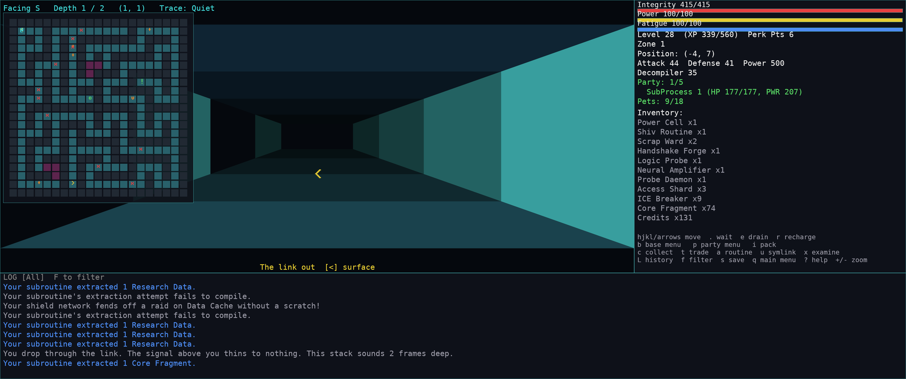

# feral-processes


A Neuromancer/Tron-flavored game blending Pokemon (tame and battle rogue
programs), Palworld (compiled programs work your base for you), and Dwarf
Fortress (procedural world, needs simulation, configurable permadeath).
Single-player, built in Rust, with a graphical frontend sitting on top of a
simulation that stays fully decoupled from presentation. A display is
required; there is no text mode.

You explore the Grid, fight or decompile the rogue programs you bump into,
and build a base whose structures your compiled programs run for you while
you are away. Scattered across every zone are links down into **the Stack**
— procedurally generated frames drawn in first person, where the fights are
harder, the returns are better, and the place notices what you take from it.
Deeper zones double every wild stat, and the only way into one is a portal
you fund yourself.



- **Tame and fight.** Party-versus-party round battles with grouped enemies,
  where only the front groups can reach you. Decompile a hostile to add it to
  your roster; five can fight beside you at once.
- **Routines.** Abilities install into level-derived slots, come from species
  kits, research, wild carriers or a Compiler's extraction, and some cast
  straight from the map as run-long buffs.
- **Cronjobs and production chains.** Post programs to structures and they
  work tick by tick wherever you are. Machines feed each other by touching, so
  a production line is a physical line across your base.
- **Research and gear.** A 19-node tech tree unlocks structures, benches and
  recipes; 31 pieces of equipment across three slots, most made from what your
  own lines produce. Gear and programs both fuse, up to three times.
- **The Stack.** Doors, sealed vaults, caches, breakpoints, faults, corrupted
  ground, orphaned programs to adopt, and a seeded boss in the deepest room. A
  Trace meter rises with everything you take and is what hunts you.
- **A base that runs without you.** Needs decay, cronjobs pay out and GC
  Entropy Sweeps chip at your buildings while you are four frames underground.
- **Permadeath or Forgiving**, chosen per run. Achievements are the one thing
  that outlives a run, and they pay out at the start of the next one.
- **Moddable.** Species, structures, items, abilities, achievements and
  research nodes are plain `.ron` files under `assets/*/` — drop one in and it
  is picked up next run, no recompiling. Difficulty tuning is deliberately
  code, in `crates/engine/src/tuning.rs`.

## Installing and playing

You need the Rust toolchain (Cargo); if you don't have it, install it with
`curl --proto '=https' --tlsv1.2 -sSf https://sh.rustup.rs | sh`. Then clone
the repo and `cargo run -p feral-processes`. The binary resolves `assets/`,
`saves/`, `run_history.log` and `profile.ron` relative to the checkout at
build time, so the clone needs to stay put even if you
`cargo install --path crates/launcher` to get `feral-processes` on your
`PATH`.

Start a **New Game** from the main menu, pick a difficulty, and press `?` in
game for the complete control list. Each session gets its own save under
`saves/`, autosaving every 50 ticks; `L` from the main menu lists every save
and `A` opens your achievements.

## Documentation

The full manual — every control, table, stat, recipe, and species — lives in
[docs/manual.md](docs/manual.md). Beside it are seven charted stat sheets, one
per content directory under `assets/`:

| Page | Charts |
|---|---|
| [roster.md](docs/roster.md) | the 17 species — stats, habitats, taming and growth |
| [items.md](docs/items.md) | the 46 items — the value ladder, gear by slot, recipes, drops |
| [abilities.md](docs/abilities.md) | the 41 abilities — target against effect, families, what a hit costs |
| [structures.md](docs/structures.md) | the 20 structures — build costs, the production lines, rates, upgrades |
| [research.md](docs/research.md) | the 19-node tech tree and what it really costs to reach the ends |
| [achievements.md](docs/achievements.md) | the 13-rung cross-run ladder and the ceiling on what it may pay |
| [perks.md](docs/perks.md) | the 12 perks, their prices, and where each magnitude lives |

Each holds a **transcribed** copy of the `.ron` files it describes, so each
has to be regenerated when those files change: edit the table at the top of
the matching `docs/*-gen.py` and run it from the repo root.

Release notes are in [CHANGELOG.md](CHANGELOG.md).

## Tests

```sh
cargo test --workspace
```
