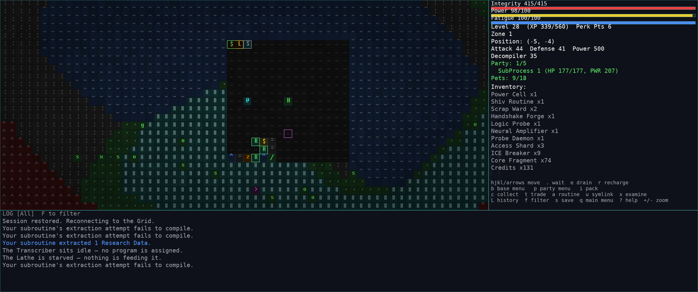

# feral-processes



A Neuromancer/Tron-flavored game blending Pokemon (tame and battle rogue
programs), Palworld (compiled programs work your base for you), and Dwarf
Fortress (procedural world, needs simulation, configurable permadeath).
Single-player, built in Rust, with a graphical frontend sitting on top of a
simulation that stays fully decoupled from presentation. A display is
required; there is no text mode.

This README is the overview. The full manual — every control, table, stat,
recipe, and species — lives in [docs/manual.md](docs/manual.md).

## Installing

You need the Rust toolchain (Cargo); if you don't have it, install it with
`curl --proto '=https' --tlsv1.2 -sSf https://sh.rustup.rs | sh`. Then clone
the repo and `cargo build`. The binary resolves `assets/`, `saves/`, and
`run_history.log` relative to the checkout at build time, so the clone needs
to stay put even if you `cargo install --path crates/launcher` to get
`feral-processes` on your `PATH`.

## Playing

Run `cargo run -p feral-processes` (or the release binary) and it launches
straight into the graphics window. Start a **New Game** from the main menu
and pick **Permadeath** (flatlining ends the run and appends a summary to
`run_history.log`) or **Forgiving** (flatlining costs Integrity and reboots
you at the nearest structure); either way you take a mild XP setback for
dying, or for a jack-out that actually gets you clear — escaping is a roll
weighed on your party's strength against the pack's, and crossing open
ground can get you ambushed. Each session gets its own save file under `saves/`,
autosaving every 50 game ticks, and `L` from the main menu lists every save
to load or delete. Press `?` in game for the complete control list.

## The loop

Explore the Grid, fight or decompile the rogue programs you bump into, and
deploy structures to put your compiled programs to work gathering resources
for you. Kills, decompiles, and completed work cycles all grant XP, and
levelling grows stats and fully restores Integrity. Hostiles are colored by
an old-school "con" system scaled to your current power rather than a fixed
per-species color, so the same program reads Green early and Red again once
a deeper zone's stat doubling catches up to you. Programs spawn in packs
that fight as groups, and both group size and how many groups engage at once
scale with zone depth and distance from your base — a zone-1 fight beside
where you materialize is a genuine one-on-one, and the deep field can throw
four groups of a hundred at you.

## Dungeons

Scattered across every zone are **breaches** (`>`) — holes down into
procedurally generated dungeon levels, seeded from the world seed and the
depth you have walked to. Step onto one and the view changes: the top-down
grid gives way to a **first-person corridor**, and `hjkl`/arrows stop being
compass directions and start being forward, back, turn left, turn right.
`<` and `>` take the stairs under you. There is no auto-map; that is what
graph paper is for.

Materializing in a sector runs a deep scan that logs how many breaches are
in it and the bearing of the nearest. One is always within sight of where
you arrive; the rest are a walk.

Corridors are not safe. Every step you take underground can draw an
intrusion, and the programs down there are drawn from the biome the breach
opens in — descend under a Mainframe sector and Mainframe programs are what
live below it. Each level down multiplies their stats, and since a kill pays
out the defeated program's Integrity, it multiplies the XP too. Descending
is the trade: harder fights, better returns, and a longer walk back.

Your base does not stop while you are down there. The player's position on
the zone map stays pinned to the breach you entered by, so cronjobs keep
paying out, needs keep decaying, and a raid can land on your Home while you
are four levels below it. Anything that reaches into the zone map — deploying
structures, trading, symlinks, resting — is refused underground; managing
your party, inventory, routines and perks is not.

## Building and cronjobs

There are no resource deposits to stumble onto — every workable node is
something you build, and deploying always costs materials. You start with a
handful of Core Fragments, Power Cells, and ICE Breakers; after that Core
Fragments come from scanning (`g`), creature drops, and eventually a Mining
Node. Build a Home first (nothing else can be deployed until it stands, and
everything else must sit within its 15-tile platform), then assign compiled
programs to structures as **cronjobs** — the Palworld-style "put a tamed
creature to work" mechanic. Production then runs tick by tick wherever you
are, paying out into your inventory at a rate that adds the structure's
upgrade tier to your zone depth — so upgrading what you have is worth more
than rushing the next portal, and neither lever runs away with the economy.

## Research

Press `T` for the research tree. Deploy a Research Node, cronjob a program
onto it, and it banks **Research Data** separately from your carrying
capacity, up to 200 — which is also why it's the one output that doesn't
scale with zone depth. Nodes cost a flat amount, may require other nodes
first, and unlock permanently and one-way: the Compiler, Terminal, Power
Conduit, iso Market, Shield, and the Fabricator/Armory benches, plus six
discounted equipment recipes. The tree is data, not code — every node is a
`.ron` file in `assets/research/`.

## Intrusions

Walking into a hostile program opens an intrusion: a party-versus-party
round battle where you pick an action for each party member and the whole
round resolves at once in freshly rolled initiative order. Enemies fight as
groups sorted by species, only a group's front member can be hit, and only
the front two groups can reach you at all — anything further back has to use
ranged moves or sit the round out, which is what keeps a deep-field fight
survivable and makes clearing front-to-back a real decision. You can Attack,
Defend, spend a Special — Decompile among them, the taming routine the
player starts with installed, spending a catalyst you hold — use an item, or
jack out; a lowercase key acts for the member currently choosing and its
uppercase counterpart acts for the whole party. Both sides are laid out as
stat tables around the combat log, including a live per-group decompile
chance so you can watch a group become worth taming. Bosses quote no chance
— they are encounters to beat, never programs to compile.

## Companions

Press `p` for every compiled program you own, wherever it is; up to five can
be active party members. Party members fight beside you, gain half your XP,
passively add 10% of their own Attack and Defense to yours, and install
abilities as **routines** into level-derived slots as they level: one slot
per two companion levels, capped at six. A species' innate kit — data files
it claims by id and unlock level, priced by cooldown and Fatigue — is
pre-installed at tame or fuse time and topped up whenever a level-up reaches
a later unlock, and an innate routine can be popped back out and swapped for
a different one. Press `m` for the routine panel (install, swap, pop out)
and `M` at a Compiler standing anywhere on the map to extract a single
routine out of any program you own — the program and its other routines are
destroyed. Not every routine comes from a kit or the research tree, though:
some exist only in the field. A wild program can spawn already carrying one
and will run it against you in battle — which is how you find out it has
it. Decompile the carrier and the routine comes over installed, ready to pop
out into whichever program you want running it instead; destroy the carrier
and the routine goes down with it. The player gets slots too, just slower:
one per ten of your own levels, same cap of six, starting with only
Decompile installed. A program
is either fighting or working a cronjob, never both. Every individual rolls
its own stats and growth rate within ±20% of the species baseline, surfaced
as a **Potential** tag, and tougher species grow faster per level. Press `f`
to fuse two programs into one stronger one — the result takes the
higher-level parent's species plus half the lower one's stats, and anything
can only be fused three times.

## Items and equipment

The consumable economy is deliberately tight: Core Fragment is the universal
raw material, Power Cells and ICE Breakers are refined from it for one
purpose each, and Portal Fragments and Research Data are the two progression
currencies. Credits are money — a trader is the only thing that mints them
and the only thing that takes them. Everything you carry counts against a shared **Buffer** starting
at 30 units and growing with each deployed Data Cache. Press `v` for the
inventory screen, where you equip, unequip, consume, erase, and fuse items
across three slots (Weapon, Armor, Module). There are 31 pieces of gear:
six cheap ones behind both a research node and a bench, and 25 that declare
their own recipe and need only a bench, spanning a Scavenged tier you can
make from turn one up to a Premium tier paid in Portal Fragments. Gear
levels double the bonus per zone level reached, fusing duplicates adds +10%
per tier, and both are locked in at the moment you equip.

## Zones and portals

Every creature is tagged with the zone it spawned in, and each zone level
doubles wild stats over the last, with another 25% per 15 tiles you wander
past your platform edge (capping at 3×). Deploy a Zone Portal — 10 Portal
Fragments plus half that again per zone below your current one — and walk
onto it to breach deeper. Your Portal Fragments and Core Fragments are wiped
in the crossing, so every zone has to fund its own exit — sell what you can
for Credits first, since those do cross — but your gear,
supplies, banked Research Data, party, and entire base — structures,
platform, upgrades, running cronjobs and all — rematerialize around the new
entry point. The portal itself is consumed, and there is no way back down.

## Structures and base defense

Structures are `.ron` files declaring any combination of roles: cronjob-
workable (Mining Node, Research Node, Power Conduit, Compiler), passively
processing (Terminal), a symlink target you can `u` to from anywhere (Home),
a rest gate, a power source (Recharger Node), a trading post (iso Market),
or a plain bench (Fabricator, Armory). Producers upgrade to Mk5 with `U`,
each tier adding to the payout and raising the chance a cycle pays out at
all, and upgrades ride through portals with the rest of the base. Every structure
except Home has raid Durability and can be chipped away by random raids: a
cronjob worker or a program posted to guard (`G`) fights the raid off at a
cost to its own HP, and every deployed Shield shaves flat damage off every
raid anywhere in the base.

## Trading

Press `t` at a nearby iso Market to sell inventory items for **Credits** at
a flat floor rate, buy ICE Breakers, Power Cells, or Portal Fragments with
them, or sell a compiled program for a tenth of its power. Credits are the
only currency a trader deals in — Core Fragments are salvage, and a trader
buys those off you like anything else rather than paying in them.

A trader keeps what you sell it. Anything you hand over goes onto its
buyback shelf, and you can purchase it back at **double** what it paid — so
a sale you regret costs a fee to undo rather than being final. The shelf
belongs to the tile the trader stands on, not the building: raze it and
rebuild on the same footprint and the stock is still there, but rebuild
somewhere else and you have opened a new store. It is wiped when you breach,
along with your salvage.

Selling a *program* is the exception: it is destroyed, not shelved. That's
still the only way to free a roster slot short of fusing it, and it's
permanent — the confirmation says so, along with any cronjob or guard post
the sale cancels. A structure's trade terms are entirely data-driven.

## Modding

Species, structures, items, abilities, and research nodes are plain `.ron`
files under `assets/*/` — drop one in and it's picked up next run, no
recompiling, with a malformed file skipped and warned about rather than
crashing startup. Each of those directories has a `README.md` documenting
its schema. A new piece of equipment or a new combat ability is a single
file and no Rust at all. Perks are the one deliberate exception: a small,
fixed, player-only set that lives in `crates/engine/src/perks.rs`. The
economy needs exactly one item holding each of the `Currency`,
`ResearchCurrency`, and `CraftCurrency` roles or the game won't start.

## Tuning difficulty

Everything the engine hardcodes about how hard the game is lives in one
file: `crates/engine/src/tuning.rs`. Zone and distance scaling, XP curves
and level caps, the damage and capture formulas, spawn and drop rates, raid
pressure, need decay, perk magnitudes — each is a documented constant in a
labelled section. Change a number, run `cargo test --workspace`, play.

It is a Rust file rather than a `.ron`, so retuning means a rebuild (a few
seconds here). That is the one deliberate difference from modding: content
is data, difficulty is code. Values that *are* data — species stats, item
and craft costs, structure economy, research costs, ability magnitudes —
stay in `assets/*/` and are not duplicated in `tuning.rs`.

Offline balance projections live next door in `balance_sim.rs`, a
deterministic, RNG-free simulator that fights zone-scaled packs against the
real `.ron` assets and asserts the resulting level curves as regression
tests. A retune that breaks progression usually shows up there first.

## Audio and fonts

The GUI plays short sound effects from `assets/sounds/` for movement,
intrusions, attacks, jacking out, winning, and flatlining; master volume
starts at 20% and moves in 10% steps with `[` and `]`, and `\` toggles
visual effects. Sound is a frontend concern the simulation knows nothing
about. Two typefaces are compiled into the binary: unscii (the pixel font
for the map grid, Public Domain/CC-0) and DejaVu Sans Mono (everything else,
Bitstream Vera license, whose notice must accompany all copies) — see
`assets/fonts/LICENSE-unscii` and `assets/fonts/LICENSE-dejavu`.

## Tests

```sh
cargo test --workspace
```

## Changelog

Release notes are in [CHANGELOG.md](CHANGELOG.md).
